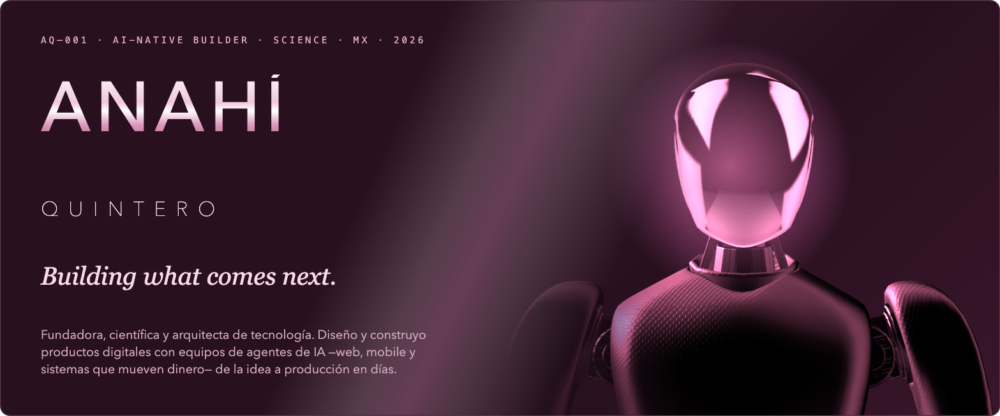
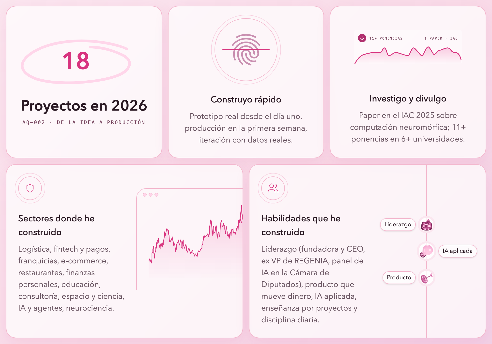

<h1>
  
</h1>

  <b>Anahí Quintero Granados</b>
  
  &nbsp;·&nbsp; she/her &nbsp;·&nbsp; Ciudad de México &nbsp;·&nbsp; Lic. en Ciencias de la Informática · IPN

  
  
  
  

  
  
  
  
  
  
  

##  &nbsp;01 — Quién soy

Fundadora, científica y arquitecta de tecnología — **AI‑native builder**: diseño la arquitectura, la construyo con equipos de agentes de IA y la pongo en producción. Fundé mi propia empresa de tecnología e inteligencia artificial, he llevado la ciencia y el código a escenarios como **Talent Land, la Cámara de Diputados y el Congreso Astronáutico Internacional (IAC)**, y sigo programando todos los días.

- **Arquitecta de tecnología** — plataformas web, apps móviles, asistentes y agentes de IA, automatización de procesos.
- **Construyo rápido** — prototipo real desde el día uno, producción en la primera semana, iteración con datos reales. 18 proyectos de software en 2026.
- **Lidero** — fundadora y CEO, ex vicepresidenta de REGENIA, encabecé el panel de IA del Foro Soberanía Digital en la Cámara de Diputados (2026).
- **Investigo** — paper en el IAC 2025 sobre computación neuromórfica; en curso: dopamina y neuroplasticidad en microgravedad.
- **Mi estética** — rosa, cristal, nubes y glitter. Código limpio, con carácter.

 

##  &nbsp;02 — Cómo desarrollo

##  &nbsp;03 — Stack

  

| Capa | Con qué |
|---|---|
| **Web** | React · Next.js · TypeScript · Node · NestJS · Express |
| **Mobile** | Flutter · Dart · Riverpod |
| **IA** | Agentes con Claude Code · RAG · FastAPI · modelos propios para avatar |
| **Datos** | Postgres · MongoDB · Firestore |
| **Nube** | Google Cloud Run · Firebase · Docker · CI/CD |
| **Pagos** | Stripe MXN/USD · wallets · comisiones multinivel |

##  &nbsp;04 — En lo que trabajo

| Proyecto | Qué es | Con qué |
|---|---|---|
| **Plataforma de logística** (cliente, en producción) | Envíos multi‑paquetería con wallet, cotizador y panel para negocios | Next.js · NestJS · Postgres · GCP |
| **Red de franquicias** (cliente, en producción) | Comisiones por niveles y pagos MXN/USD | React · Firebase · Stripe |
| **Floer** | App móvil de libertad financiera (mi primera app en Flutter) | Flutter · Riverpod · Postgres |
| **JARVIS** | Mi sala de misiones: agentes que trabajan mientras yo diseño | Claude Code · Python · macOS |
| **Ad Astra** | Un año de fundamentos: inglés, programación, matemáticas y el paper del IAC 2027, con evidencia diaria | Python · PDF |
| **Patrones que gobiernan el mundo** | Tesis propia: los patrones que se repiten en economía, biología y redes, con simulaciones | Python |

*Los proyectos de clientes viven en repos privados y no se nombran aquí; si quieres saber más, escríbeme.*

##  &nbsp;05 — Reconocimientos

- **Líder Espacial Emergente** — FAMEX, Feria Aeroespacial México 2025
- **Perfil destacado** — Revista Líderes del Éxito, marzo 2026
- **Women in Tech** — circuito universitario
- **Mentora** y charla inaugural — **NASA Space Apps Challenge México 2025** · co‑organización **Global Space Week UNAM 2024**

##  &nbsp;06 — Annie Lab

<picture>
  <source media="(prefers-color-scheme: dark)" srcset="https://raw.githubusercontent.com/anahiquintero99/anahiquintero99/output/snake-dark.svg" />
  
</picture>

<code>AQ—000</code>  *Building what comes next.*

